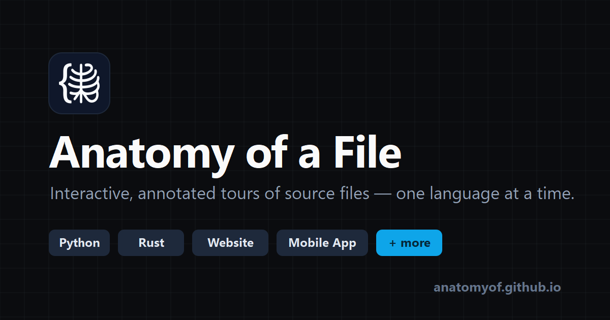

<div align="center">

<a href="https://anatomyof.github.io">
  
</a>

<p><em>An interactive, annotated tour of what's inside a source file — one language at a time.</em></p>

<p>
  <a href="https://anatomyof.github.io"></a>
  <a href="LICENSE"></a>
  
  
  
</p>

</div>

---

**[Anatomy of a File](https://anatomyof.github.io)** opens an example source file in a code
window with color-coded callouts explaining every structural part — shebang, imports, class
definitions, control flow, and more. **Hover** a callout to trace it into the code; **click**
it for an in-depth writeup. Every language ships a **minimal** and a **verbose** example,
light & dark themes, and shareable URLs like
[`/#/python/verbose`](https://anatomyof.github.io/#/python/verbose).

Beyond real languages, **concept pages** dissect the structural anatomy of a website, a
settings screen, a mobile app, a dashboard, and an email — the same idea, applied to things
that aren't code.

## ✨ Highlights

- 🔬 **42 languages + 5 concept pages** — from Python and Rust to COBOL, AWK, and WebAssembly
- 🎨 **Color-coded callouts** wired to the exact lines they describe
- 🖱️ **Hover to trace, click to dive** — a full deep-dive modal per concept, with a *Learn more* link
- 🌗 **Light & dark themes**, and **fully mobile-responsive** (tap to pin a callout, tap again to open it)
- 🧭 **Sidebar ranked by real-world popularity** (TIOBE Index) with instant search
- ⚡ **Syntax highlighting by [Shiki](https://shiki.style)** — the same engine VS Code uses
- 🔗 **Deep-linkable URLs** for every language and variant
- 🥚 A few easter eggs hiding behind the code window's traffic-light buttons

## 🚀 Live

### → **[anatomyof.github.io](https://anatomyof.github.io)**

## 🛠️ Built with

**Bun** · **Vite** · **Vue 3** · **TypeScript** · **Tailwind CSS 4** · **Reka UI** · **Shiki** · **Biome**

## 🧑‍💻 Develop

```sh
cd app
bun install
bun run dev      # http://localhost:5173
bun run build    # type-check + production build
bun run check    # biome lint/format + grammar/example checks
```

The live site is built and deployed by GitHub Actions in the companion
[anatomyof.github.io](https://github.com/AnatomyOf/anatomyof.github.io) repo, which builds
this repo's `app/` on a schedule and on demand.

## ➕ Adding a language

Everything is data-driven — one file per language in `app/src/data/`:

1. Create `app/src/data/<id>.ts` exporting a `LanguageDef`: metadata, an annotation
   catalog (card text + modal deep-dive), and two example variants built from
   **segments** (`{ code, refs }`). Line ranges are derived automatically — never
   hand-counted. For a non-language "concept" page, set `category: 'concept'` and
   `titleNoun: ''`.

   **Humor is part of the spec.** Every example must carry a little tasteful,
   language-specific coding humor — comical, ironic, or a nerdy in-joke/quote a
   dev of that language would appreciate (Zen of Python, Rust's borrow checker,
   Perl's write-only reputation, …). Put it **only** in comments and string/print
   literals, keep the code valid and still clearly teaching, and never rename an
   identifier that an annotation references. 2–5 touches per language.
2. Add the grammar import to `app/src/lib/highlighter.ts` (enforced by
   `scripts/check-grammars.ts`, which runs in `bun run build`/`check`).
3. Register it in `app/src/data/index.ts` (add it to the `catalog` array and set a
   `popularity` rank on the `LanguageDef`) and remove it from `comingSoon.ts`. The
   catalog's array order is cosmetic — the sidebar's **Languages** group is sorted in
   code by `popularity` (TIOBE Index position; lower = higher up, with a documented
   convention for entries TIOBE can't rank). Concepts omit `popularity` and keep the
   curated order they appear in.

> Brand assets (favicon, social card, in-app mark) are all generated from
> `app/public/logo.svg` via `bun run scripts/gen-brand.ts`.

## 📄 License

[MIT](LICENSE) © [LunarWerx](https://lunarwerx.com) — free to use, fork, and adapt.

<div align="center">
  <br />
  <a href="https://anatomyof.github.io"></a>
  <br /><br />
  <sub>Built by <a href="https://lunarwerx.com"><b>LunarWerx</b></a> · Deployed on GitHub Pages</sub>
</div>
